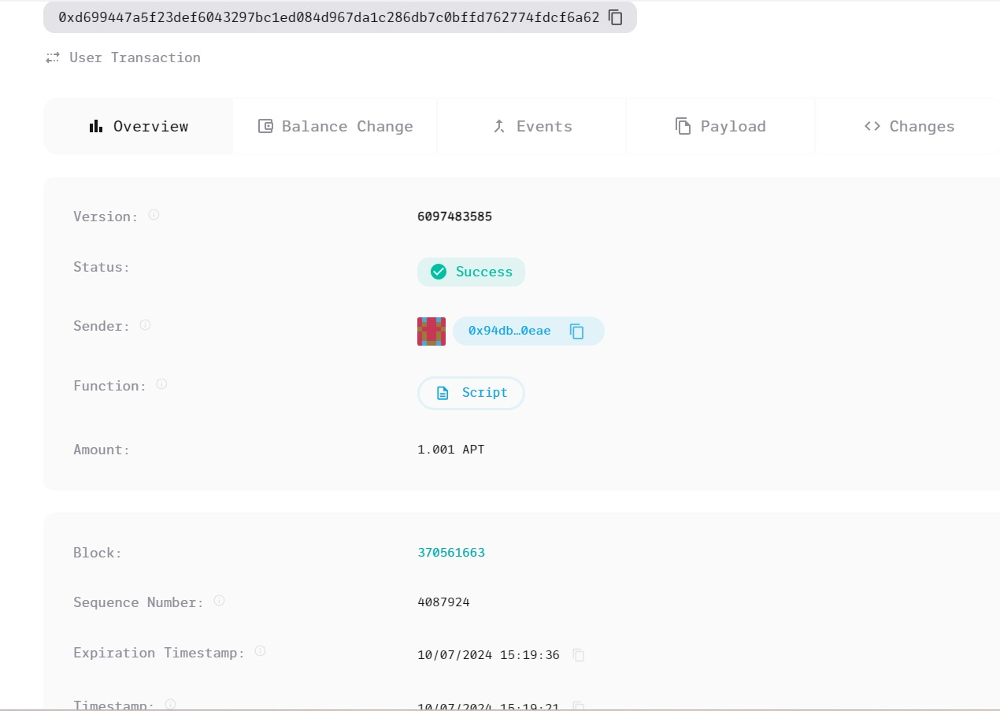

### Deployed smartcontract address: 0x2f98c06045717acbb82cad6ac477ab4cd02429e851694eeb890d0d16837c86b5

### Screenshot: 

# Job Referral Platform

## Project Title
**Job Referral Platform**

## Project Description
The Job Referral Platform is a decentralized system where users can refer others for jobs and earn rewards if their referred candidate is successfully hired. It ensures that referrers are incentivized through a trustless, transparent system using smart contracts to handle the referral and reward process.

## Vision
To create a fair and transparent job referral system that automates the referral process and ensures referrers receive their rewards in a decentralized and trustless manner. This platform aims to boost user engagement in referral programs by leveraging blockchain technology.

## Key Features
- **Referral Creation**: Users can create job referrals by providing the address of the person they are referring.
- **Reward Distribution**: Once the referred person is hired, the referrer receives a reward in the form of tokens.
- **Immutable Records**: All referrals are stored on the blockchain, ensuring transparency and trust.
- **One-time Reward Claim**: Rewards can only be claimed once per referral, ensuring fairness.

## Future Scope
- **Integration with Decentralized Identity (DID)**: Allow users to link verified identities for more secure referrals.
- **Reputation System**: Implement a reputation system where successful referrers are rated based on the quality of their referrals.
- **Multi-Currency Support**: Allow rewards in various cryptocurrencies beyond Aptos tokens.
- **Referral Analytics**: Provide employers and referrers with insights on referral performance and success rates.
- **Automated Hiring Process**: Integrate smart contracts with decentralized hiring platforms to further streamline the process.
